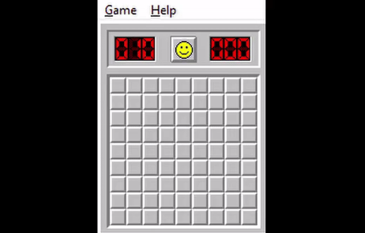
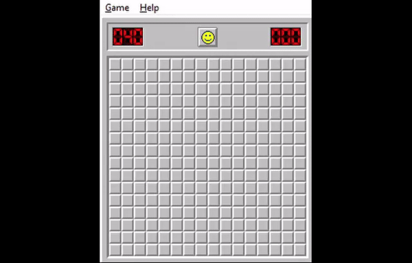

# irina - An AI That Solves Minesweeper!

Built using Python. <b>I</b>nquisitive <b>R</b>iddler <b>I</b>nvestigating <b>N</b>avigational <b>A</b>rteries (in minesweeper), or irina for short (cause she is), is an Artifically Intelligent Model to solve Mineweeper by utilizing a probabilstic approach. Most Exciting Thing? This algorithm is nearing world record timings and this is just the beginning.

<table style="font-size: 20px;">
  <thead>
    <tr>
      <th>Stage</th>
      <th>Time</th>
    </tr>
  </thead>
  <tbody>
    <tr>
      <td>Beginner</td>
      <td>5s</td>
    </tr>
    <tr>
      <td>Intermediate</td>
      <td>15s</td>
    </tr>
    <tr>
      <td>Expert</td>
      <td>32s</td>
    </tr>
  </tbody>
</table>

|Beginner|Intermediate|Expert|
|-|-|-|
|  |  |  |

#### You get: _Finally solve the game, Flex to friends, Peace of Mind_   I get _(hopefully): Star, Heart, Follow :)_

## Install 
(exclusive to Windows presently)

    Requirements: gh, pip, python 3.12+
    Run the following commands:
    gh repo clone aryankeluskar/irina.minesweeper
    pip install -r requirements.txt

## Run the app 
The app will auto-calibrate itself to your device's display assuming that you adhere to using the WINMINE.EXE given in the repo. Use the following command   

    python main.py

And let the magic (a.k.a. irina) shine brighter than all neon on broadway (pretty normal stuff imo)
   
## How does it work?
It starts by randomly tapping 3 cells, then finds the probability of surrounding cells being a mine while training a Reinforcement Learning model in background to predict the next set of non-mine cells and click on them. This process repeats until there are no non-mine cells remaining. Motivation? My close friend and I were getting nostalgic over our high school memories of playing this beautifully haunting game but never winning, so I built this project to redeem our younger selves.

## Support this project!
### This has been quite an ambitious project (and a super memorable one ofc)! Please consider leaving a 🌟 if this added value to your wonderful life :)
### Made with pure love and [freshman fascination](## "it's a real term i swear"). Visit my website at [aryankeluskar.github.io](https://aryankeluskar.github.io) <3
